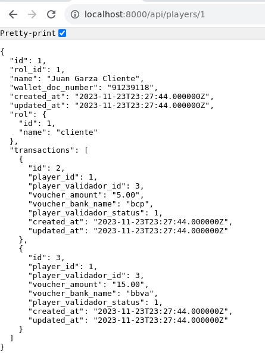
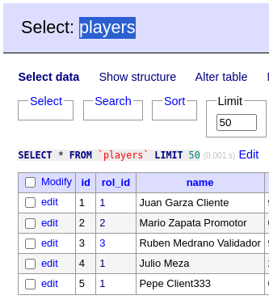
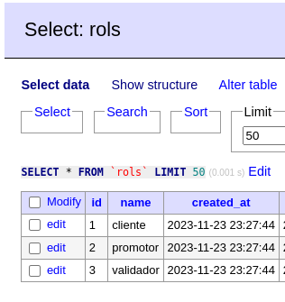

# Caso Practico AT

## Description [spanish]

[ Aquí el documento técnico ](./docs/caso-practico-AT.pdf)

## Tasks

- Enviar los curls de las apis que puedas crear en Laravel
- Y de la conexion del server en tiempo real en NodeJs

### Installation by docker

1.- You must be installed **docker** and **docker-compose** in your system.

2.- Clone the repository in local env

    git clone git@github.com:enlacee/caso-practico-at.git

3.- Move to `caso-practico-at` folder

    cd caso-practico-at

4.- Execute the next docker command: for building the containers

    docker-compose up --build

5.- Access to the container `backend-laravel`

    docker exec -i -t <container-id> /bin/sh

6.- Access to the web app

* Backend-Laravel: http://localhost:8000
    * Utility-Adminer: http://localhost:8001
        - HOST: mysql_db
        - PORT: 3306
        - USER: root
        - PASS: root
* Backend-Node: http://localhost:3000

7.- Execute the next command for:

1. Install tables:

```bash
    docker exec -it <container-id> php artisan migrate
    ;docker exec -it <container-id> php artisan migrate:refresh
```

2. Fill data:

```bash
    docker exec -it <container-id> php artisan migrate --seed
```

### Resources webDeveloper

[Postman Collection here](./docs/postman-collection/Caso-Practico-API-REST.postman_collection.json)


### Preview Project API-REST (player)




### Entregables Esperados

1. Codigo Fuente: https://github.com/enlacee/caso-practico-at

2. Archivo con los script: [SQL](./docs/laravel_docker.sql)
    Nota: este es un dump sql de las 4 tablas que se usan:
    - players
    - rols
    - transactions
    - promotor_comunications

3. Usuarios y perfiles usados

Usuarios: yo los llame **players**


Perfiles: yo los llame **rols**
